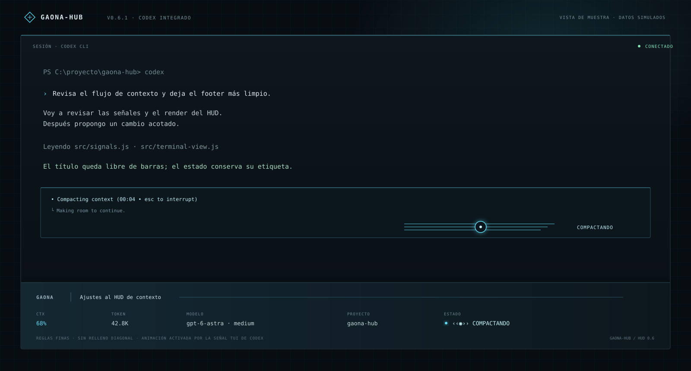

# GAONA-HUB · byGaona

[Download for Windows](https://github.com/planetagaona-stack/GAONA-HUB/releases/latest) · [MIT license](LICENSE)



## Instalar en tu otro PC

Necesitas Windows Terminal, Node.js 20+ y Codex CLI instalado e iniciado con tu
cuenta. En **Releases**, descarga el ZIP de Windows, extráelo y ejecuta:

```powershell
powershell -NoProfile -ExecutionPolicy Bypass -File .\scripts\install.ps1 -IntegrateCodex -GlowCurrentPowerShell
```

Luego abre una terminal nueva y escribe `gaona-hub.cmd`. El HUD usa las sesiones
locales de ese PC; el repositorio y el instalador no incluyen tus chats ni tus
credenciales. El código y el diseño se distribuyen bajo licencia MIT.

---

Official Codex CLI chat with a neon HUD **fixed below it in the same terminal**.
No separate dashboard window and no patched or downgraded Codex binary.
Independent community project; not affiliated with OpenAI.

## Install

Tested on Windows 11 x64, Node.js 24.19.0 and official Codex CLI 0.159.3.
Use Windows Terminal. Node.js 20+ and an existing Codex CLI are required.
Installation downloads dependencies from npm. Windows x64 uses node-pty's
included native binaries. Other platforms may require native build tools and
have not been runtime-tested by this release.

Extract the release ZIP:

```powershell
npm.cmd install -g .\gaona-hub-0.4.3.tgz
gaona-hub.cmd
```

Or run the installer. Add `-IntegrateCodex` to make the `codex` command use the
integrated launcher in new PowerShell sessions:

```powershell
powershell -NoProfile -ExecutionPolicy Bypass -File .\scripts\install.ps1 -IntegrateCodex
```

The installer uses your npm prefix and updates your user PATH if needed. Optional
integration adds a marked function to PowerShell 7 and Windows PowerShell user
profiles, preserving existing contents and creating backups. It does not replace
the official executable or change Codex permissions. Open a new terminal to load
the integration. Administrator access is unnecessary with a user-owned npm
prefix. Execution-policy bypass applies only to that installer invocation.

## Start or resume

```text
gaona-hub                         Codex chat + bottom HUD
gaona-hub -- resume <session-id>   Resume an existing conversation
gaona-hub -- resume --last         Open the latest conversation
gaona-hub --project <path>         Choose the starting directory
gaona-hub run --plain -- --version Ordinary CLI command without the HUD
gaona-hub status --json            Local metadata snapshot
gaona-hub demo --width 200         Explicitly labeled demo design
gaona-hub watch                    Optional standalone monitor
gaona-hub doctor                   Diagnostics
```

Everything after `--` is forwarded literally to Codex, including your chosen
permission flags. Normal keyboard shortcuts, approvals and authentication belong
to Codex. **Shift+PageUp/PageDown** scrolls local terminal history. Resizing keeps
the HUD at the bottom. Small windows show fewer metrics to leave room for chat.
Use `--ascii --no-color` for a basic display.

Codex locks conversations open in another interface. Close that session before
resuming here. The launcher cannot retrofit an already running CLI's screen;
reopen the conversation ID with the command above.

## Integration

Window and tab titles use the saved Codex chat name from the local session index
and follow renames. Without a saved name they show the project directory; the
user home directory shows **Nueva tarea** instead of your username.
You can choose a task name explicitly:

```powershell
gaona-hub.cmd --title "Actualizar drivers"
```

`--title` changes only the displayed window title, not the saved Codex chat name.
The HUD does not generate a name by reading your prompts.

Codex runs in a real pseudoterminal above the reserved HUD. An xterm VT emulator
confines clears, scrolling and alternate screens to that viewport. Keyboard,
bracketed paste, mouse modes and terminal query replies are forwarded. Only
changed rows are redrawn.

Temporary child-process settings request native title fields for session ID,
model, reasoning and status, and hide the redundant standard status line. The
OSC title identifies the actual conversation. Shortened IDs are resolved only
when exactly one local session filename matches, then checked against metadata.
Unknown or ambiguous IDs stay unavailable; another agent's latest session is
never adopted. Model and status may appear before token metadata is written.
These display overrides do not edit `config.toml`.

The Windows installer creates a **Gaona-HUB** Windows Terminal profile with a
subtle GPU glow shader. Saturated HUD colors glow near the footer; white chat
text stays sharp. `-GlowCurrentPowerShell` also applies the shader to your current
PowerShell profiles. The previous shader settings are retained in one installation
state file and restored by uninstall. The bundled HLSL needs no compiler to run.

The viewport supports Unicode and terminal colors. Some terminal extensions,
including inline image protocols and OSC clipboard forwarding, are not
implemented. Future Codex title/event formats need compatibility verification.
The optional legacy `run --native --codex <compatible-binary>` mode remains for
separately supplied binaries supporting command-backed status lines.

## Metrics

- **CTX:** last reported context tokens / model context window.
- **IN / OUT:** cumulative session counters; not billing estimates.
- **MODEL:** live model and reasoning; session metadata as a fallback.
- **GIT:** branch; `*` indicates tracked modifications.
- **PROJECT:** directory recorded by the bound conversation.
- **STATUS:** live status; recorded task status as a fallback.
- **SEMANAL:** remaining percentage in a reported window of at least seven days.
- **REINICIO:** time remaining until that window resets.
- **TAREA:** recorded task duration, frozen on completion or interruption.

CTX and weekly quota have separate bars beside each other. The header shows
native **FAST ON/OFF**, the last typed slash-command name, and the last explicitly
invoked skill or detected SKILL.md read. CMD records the submitted command name,
not its arguments; commands selected entirely through menus may not be captured.
Skill names describe the last observed use, not a guarantee that it is still active.

Unavailable fields show `—`; live mode never substitutes demo values. Archived
sessions are not monitored. Files are scanned in 256 KiB chunks, then read
incrementally. Incomplete lines are retried; records larger than 2 MiB are
skipped. Explicitly selected older sessions can be read outside the thirty most
recent files. Native status takes precedence over a stale recorded task status.

## Privacy

The emulator holds the Codex screen in memory to display chat, without saving
or uploading that screen. The metric reader retains structured metadata without
retaining message bodies or tool arguments. It reads `$CODEX_HOME/sessions`
(default `~/.codex/sessions`), the bound chat name from `session_index.jsonl`,
and local Git metadata. No HUD server, telemetry,
network listener or API-key reader is used. Codex keeps its normal connection.
JSON snapshots contain local paths, session IDs and saved chat names; review before sharing.

## Develop and share

```sh
npm ci
npm test
npm run pack:check
npm run release
```

The release script produces an npm archive, checksums and a versioned release
folder under `dist/`. Zip that folder for sharing. MIT source; dependency licenses
are in `THIRD-PARTY-NOTICES.txt`. Downloads are distributed through GitHub
Releases. This package is not published to the npm registry; registry publication
requires an available name/scope and the publisher's account.

`scripts/verify-terminal.js <cli-path> <source-session-id> <directory>` performs
the Windows ConPTY smoke test in a temporary fork, without submitting a prompt.

## Uninstall

If you enabled profile integration, remove it and the package using:

```powershell
powershell -NoProfile -ExecutionPolicy Bypass -File .\scripts\install.ps1 -Uninstall
```

Otherwise run `npm.cmd uninstall -g gaona-hub`. Reopen PowerShell.
Official Codex, permissions and conversations are kept.
